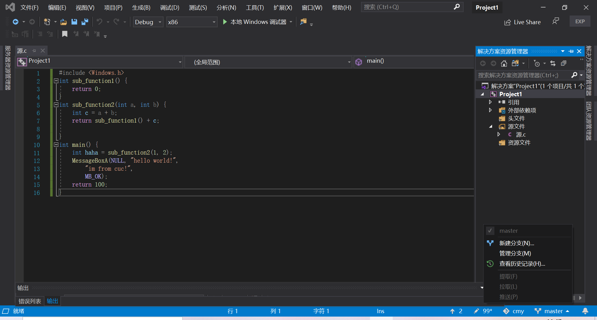
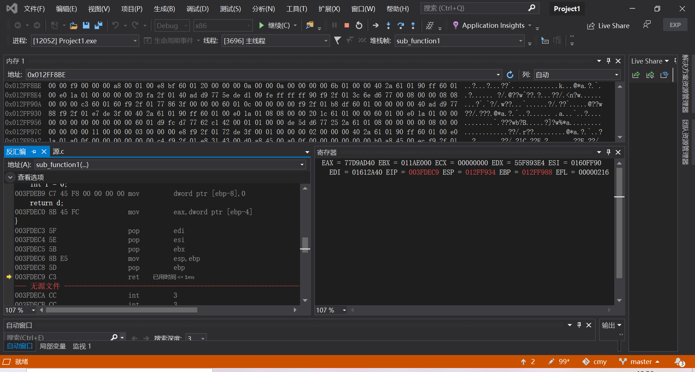
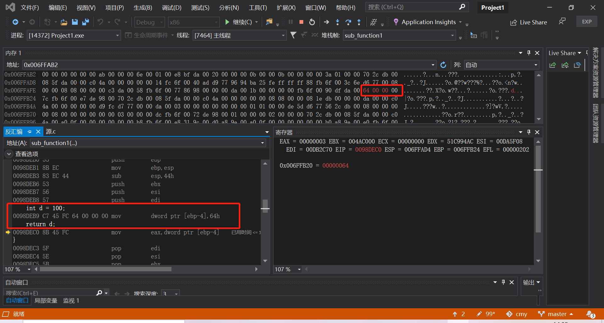

#         第一章实验笔记

#### 1、在vs中建立工程，修改编译选项，只保留 /ZI （调试）和pdb文件路径两个选项，增加禁用安全检查选项（/GS-)。

建立一个空项目，在配置资源管理器-属性-C/C++里按照要求修改编译选项

### 2、编译多个函数调用的示例代码。

在项目里新建一个.c文件，写下图所示代码

### 3、下断点调试运行，观察反汇编、寄存器、内存等几个调试时的信息。

解决资源管理器的project1右键点击生成

在上图11行加断点，并F5开始调试

调试开始后，在调试窗口中打开内存，寄存器，反汇编窗口，用来观察栈的变化：

### 4、分析函数调用过程中栈的变化。解释什么是栈帧？ebp寄存器在函数调用过程中的变化过程，ebp寄存器的作用。

首先可以看出，函数调用过程中栈是由高地址逐渐向低地址扩大，所以栈是向下生长的。

栈帧是两个指针寄存器，寄存器ebp为帧指针（指向该栈帧的最底部），而寄存器esp为栈指针（指向该栈帧的最顶部）

由上图可知，在main函数未调用函数sub_function2时，ebp寄存器里存入了main函数的栈底地址

当main函数调用sub_function2函数开始时，根据汇编语言可以看出，先把两个参数压入栈，再call sub_function2; 调用sub_function2，将返回地址填入栈，并跳转到sub_function2：

在sub_function2中，汇编语言

push ebp 这一步把上面的函数main的栈帧底部保存起来，这一步表示sub_function2函数即将有自己的栈帧，为了sub_function2函数调用后ebp指针还能返回main函数的栈帧底部，所以将main的栈帧底部地址保存起来。如下图所示，main函数的栈帧底部地址012FF9E8被存入到地址012FF988的内存中：

mov ebp, esp;将ebp指向esp所指的地址，表示上一栈帧的顶部，就是这个栈帧的底部。

接下来，就开始新的栈，这时ebp指向新栈的底部，esp指向当前的栈顶，随着sub_function2函数的继续执行，esp指针不断指向新的栈顶：

在sub_function2函数中调用了sub_function1函数，其过程与main函数调用sub_function2函数过程相同，先是push ebp 这一步把上面的函数sub_function2的栈帧底部保存起来,mov ebp, esp;将指针移向新的栈底，表示上一栈帧的顶部，就是这个栈帧的底部：

当从sub_function1函数返回时，首先释放edi，esi，ebx寄存器的值，mov esp,ebp 表示esp逐渐移动到栈帧底部（即释放局部变量）：

pop ebp：把上一个函数的栈帧底部指针弹出到ebp,再弹出返回地址，通过ret，ebp,esp就回到了调用函数前的状态，即现在恢复了原来的sub_function2的栈帧，sub_function1函数的栈被成功弹出：

sub_function2函数弹出栈并返回到main函数的过程与sub_function1函数弹出栈返回到sub_function2的过程基本相同:

### 5、函数局部变量和参数的保存位置、访问方式是什么。

函数sub_function2中的参数在一开始压栈时存到了012FF994和012FF990中，而函数sub_function2的栈的基底地址也是ebp在sub_function2调用时所指的地址012FF988，所以该函数参数保存在ebp+8和ebp+8+4的地方

函数参数访问方式为指针访问，从下图也可以证明，函数sub_function2的参数保存在ebp+8和ebp+8+4的地方

局部变量c的值保存在012FF984，也就是ebp-4的地址中，访问方式也是指针访问

下图解释了ebp，参数和局部变量在内存中的分布：

### 6、多层的函数调用，栈的变化情况，解释未赋初始值的局部变量的值是如何形成的。

在多层函数进行调用时，都会为函数分配新的栈，新的栈底是前一个函数的栈顶，当当前的函数调用完成后，就会弹出当前栈，返回到上一个函数的栈中，如果有新函数需要调用，则继续压栈，所以在多层的函数调用中，函数的调用和返回就是不断地压栈退栈的过程。

定义局部变量,其实就是在栈中通过移动栈指针,来给程序提供一个内存空间和这个局部变量名绑定。因为这段内存空间在栈上,而栈内存是反复使用的(脏的,上次用完没清零的) ,所以未赋初始值的局部变量的值的值就是一个垃圾值。操作系统仅仅是回收这些内存,告诉其他程序可以用了,但并不删除这些内存里面的数据。

写了如图所示的代码：

sub_function1和sub_function3结构相同，且都为sub_function2调用，定义了sub_function1中的局部变量为一个确定的值100，sub_function3中的局部变量未赋值，可以看到，sub_function3和sub_function1所用的是同一块内存，因为sub_function1退栈后紧接着调用sub_function3，所以他们的栈底地址都是sub_function2的栈顶地址，所以sub_function3的局部变量所用的内存也和sub_function1相同，由于sub_function1退栈后内存中的值并没有被清空，所以未被赋值的sub_function3函数的局部变量和已被赋值的sub_function1的局部变量的值相同:

上述过程解释了未赋值局部变量中的值的来源，也证明了在多层函数的调用过程中栈的变化和内存的反复使用。